# JARVIS - AI Personal Assistant

[](https://opensource.org/licenses/MIT)


JARVIS is an AI-powered personal assistant designed to bridge the gap between intelligence and execution. Unlike conventional assistants that stop at conversation, JARVIS extends its capabilities into your local operating system - opening applications, managing system controls, navigating the web, and responding visually to the world around it.

At its core, JARVIS is a modular, locally-aware AI system that combines cloud-level reasoning with on-device control. It listens, understands, decides, and does things, bringing the concept of a truly functional AI assistant closer to reality.

##  Tech Stack

| **Category**              | **Technologies** |
|---------------------------|------------------|
| **Programming Languages** | [](https://docs.python.org/3/) |
| **AI / LLM**              | [](https://groq.com/) |
| **Vision Models**         | [](https://arxiv.org/abs/2201.12086) |
| **Memory / Vector DB**    | [](https://docs.trychroma.com/) |
| **Web Search**            | [](https://serper.dev/) |
| **Backend Framework**     | [](https://fastapi.tiangolo.com/) |
| **Frontend Framework** | [](https://react.dev/) [](https://www.typescriptlang.org/docs/) |
| **Local Automation**      | [](https://docs.python.org/3/library/os.html) [](https://docs.python.org/3/library/subprocess.html) [](https://pyautogui.readthedocs.io/en/latest/) |
| **Tools**                 | [](https://git-scm.com/doc) [](https://code.visualstudio.com/docs) |
| **Deployment / Runtime**  | [](https://www.uvicorn.org/) |
                                                                                              
---

## 🏗️ System Architecture

JARVIS operates on a **modular architecture** designed for **speed, privacy, and extensibility**.  
The system is divided into three core components: the **AI Brain Layer**, **Vision Module**, and **Local Agent**.

```mermaid
graph TD
    User([👤 User Input]) --> Brain
    Brain[🧠 AI Brain Layer] -->|Text Query| Chat[💬 Response]
    Brain -->|Visual Data| Vision[👁️ Vision Module]
    Brain -->|System Command| Agent[⚙️ Local Agent]
    
    Vision --Description--> Brain
    Agent --Action--> OS[💻 System / OS]
```



### 🧠 1. AI Brain Layer
The **central intelligence** of the system responsible for reasoning, understanding, and orchestration.

**Powered by:** Groq LLM

This layer acts as the **decision-maker**. It analyzes user input, determines intent, and routes tasks to the appropriate module.

**Key Responsibilities:**
- **Natural Language Understanding:** Interprets complex user queries.
- **Decision Making:** Determines whether to chat, look, or act.
- **Task Routing:** Directs tasks to the Vision Module or Local Agent.

---

### 👁️ 2. Vision Module
The **visual cortex** that enables the system to interpret images.

**Powered by:** BLIP (Image Captioning)

When an image is uploaded, this module converts visual data into text that the AI Brain can process.

**Key Capabilities:**
- **Image-to-Text:** Generates meaningful descriptions of images.
- **Visual Question Answering (VQA):** Allows users to ask questions about images.
- **Scene Understanding:** Analyzes context and objects within visual inputs.

---

### ⚙️ 3. Local Agent
The **execution layer** that interacts directly with the Operating System.

**Runs on:** Local Host (Low latency & secure)

This module allows JARVIS to move from **understanding** to **action** by executing commands on the user’s machine.

**Core Functions:**
- **App Management:** Open, close, and manage applications.
- **System Controls:** Adjust volume, brightness, and power settings.
- **Web Automation:** Launch websites and perform browser actions.

---
## 📂 Project Structure

```text
JARVIS/
├── backend/                        # Main Server & Logic
│   ├── brain/                      # AI Intelligence Modules
│   │   ├── llm_services.py         # Connects to LLM (Groq/Ollama)
│   │   ├── local_multimodal.py     # Image recognition logic
│   │   ├── memory_manager.py       # Handles chat history & context
│   │   ├── speech_services.py      # STT and TTS handlers
│   │   └── web_search.py           # Google Search integration
│   ├── chroma_db/                  # Vector Database for Long-term memory
│   ├── main.py                     # FastAPI Entry Point (Run this to start)
│   ├── auth.py                     # User Authentication & Security
│   ├── agent.exe                   # Compiled Local Agent executable
│   └── users.db                    # User database
│
├── frontend/                       # User Interface (React + Vite)
│   ├── src/
│   │   ├── components/
│   │   │   ├── ChatInterface.tsx   # Main chat window
│   │   │   ├── Login.tsx           # Authentication screen
│   │   │   └── Sidebar.tsx         # Chat history navigation
│   │   ├── api.ts                  # Connection to Backend
│   │   ├── App.tsx                 # Main Application Layout
│   │   └── main.tsx                # Frontend Entry Point
│   ├── package.json
│   └── vite.config.ts
│
├── local_agent/                    # OS Control Source Code
│   ├── agent.py                    # Websocket client for OS commands
│   └── os_controller.py            # Logic to open apps/control system
│
├── voices/                         # Audio Assets
│   └── jarvis_voice.wav            # Reference audio for voice cloning
│
├── requirements.txt                # Python Dependencies
└── README.md                       # Project Documentation

```

## 🚀 How to Run JARVIS locally

JARVIS can be run locally for development and testing. A hosted version is planned and will be added soon.


#### 1️⃣ Clone the Repository
```bash
git clone https://github.com/your-username/JARVIS.git
cd JARVIS
```
#### 2️⃣ Move to backend directory
```bash
cd backend
```
#### 3️⃣ Create & Activate Virtual Environment
```bash
python -m venv venv
venv\Scripts\activate
```
#### 4️⃣ Install Dependencies
```bash
pip install -r requirements.txt
```
#### 5️⃣ Set Environment Variables
Create a .env file in the root directory and add:

```bash
GROQ_API_KEY=your_groq_api_key
SERPER_API_KEY=your_serper_api_key
```

#### 6️⃣ Run the Backend Server
```python
python main.py
```
#### 7️⃣ Start frontend
Start a new terminal and move to frontend
```bash
cd frontend
```
Install dependencies and run
```bash
npm install
npm run dev
```


---
## 🤝 Contributors

- [Avanish Salunke](https://github.com/AvanishSalunke)
- [Pratyush Rao](https://github.com/PratyushRao)
- [Purvasha Singh](https://github.com/purrvax)
- [Kavish Nasta](https://github.com/kavishnasta)

